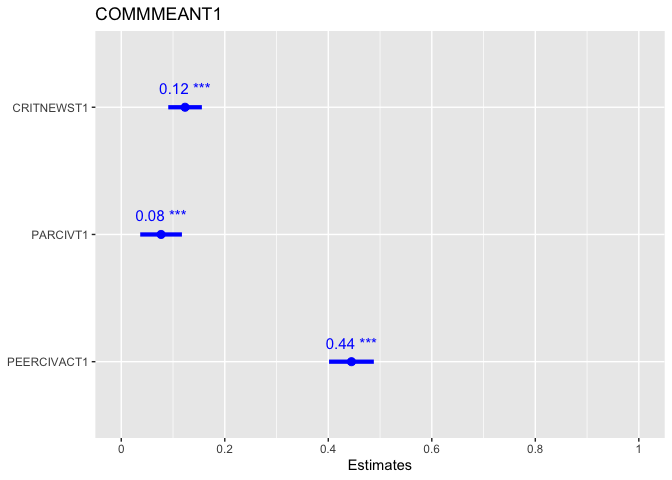

PY329 Project
================
Mursal Jahed
2024-10-11

\#load packages

``` r
library(haven)
library(dplyr)
```

    ## 
    ## Attaching package: 'dplyr'

    ## The following objects are masked from 'package:stats':
    ## 
    ##     filter, lag

    ## The following objects are masked from 'package:base':
    ## 
    ##     intersect, setdiff, setequal, union

``` r
library(ggplot2)
library(tidyr) 
library(psych)
```

    ## Warning: package 'psych' was built under R version 4.3.3

    ## 
    ## Attaching package: 'psych'

    ## The following objects are masked from 'package:ggplot2':
    ## 
    ##     %+%, alpha

``` r
library(car)
```

    ## Loading required package: carData

    ## 
    ## Attaching package: 'car'

    ## The following object is masked from 'package:psych':
    ## 
    ##     logit

    ## The following object is masked from 'package:dplyr':
    ## 
    ##     recode

``` r
library(lmtest)
```

    ## Loading required package: zoo

    ## 
    ## Attaching package: 'zoo'

    ## The following objects are masked from 'package:base':
    ## 
    ##     as.Date, as.Date.numeric

``` r
library(performance)
```

    ## Warning: package 'performance' was built under R version 4.3.3

``` r
library(sjPlot)
```

    ## Warning: package 'sjPlot' was built under R version 4.3.3

``` r
#load dataset
load("/Users/mursal_j/Downloads/ICPSR_36561/DS0001/36561-0001-Data.rda")
```

\#select variables

``` r
projectdata <- da36561.0001 %>%
  select(PEERCIVACT1, PARCIVT1, COMMMEANT1, GENDERT1, ETH_MCT1, LIFE_MEAN_1T1, LIFE_MEAN_2T1, LIFE_MEAN_3T1, LIFE_MEAN_4T1, LIFE_MEAN_5T1, GRADET1)
#create composite of life meaning
projectdata <- projectdata %>%
  mutate(life_meaning = rowMeans(cbind(LIFE_MEAN_1T1, LIFE_MEAN_2T1, LIFE_MEAN_3T1, LIFE_MEAN_4T1, LIFE_MEAN_5T1)))
```

# Missing Data: listwise deletion, and verification that no NA values remain.

``` r
summary(projectdata)
```

    ##   PEERCIVACT1       PARCIVT1       COMMMEANT1          GENDERT1  
    ##  Min.   :1.000   Min.   :1.000   Min.   :1.000   (0) Male  :754  
    ##  1st Qu.:3.333   1st Qu.:2.000   1st Qu.:2.000   (1) Female:811  
    ##  Median :3.667   Median :2.750   Median :2.600   NA's      : 13  
    ##  Mean   :3.749   Mean   :2.618   Mean   :2.651                   
    ##  3rd Qu.:4.333   3rd Qu.:3.250   3rd Qu.:3.200                   
    ##  Max.   :5.000   Max.   :5.000   Max.   :4.000                   
    ##  NA's   :127     NA's   :114     NA's   :146                     
    ##                                                                                   ETH_MCT1  
    ##  (3) Hispanic or Latino, including Mexican American, Colombian, Nicaraguan, and others:723  
    ##  (1) Asian or Asian American, including Chinese, Indian, Korean, and others           :401  
    ##  (6) Mixed; Parents are from different groups                                         :153  
    ##  (7) Other                                                                            :102  
    ##  (4) White, Caucasian, European American; not Hispanic                                : 98  
    ##  (Other)                                                                              : 90  
    ##  NA's                                                                                 : 11  
    ##                         LIFE_MEAN_1T1                        LIFE_MEAN_2T1
    ##  (1) Strongly Disagree         : 38   (1) Strongly Disagree         : 33  
    ##  (2) Disagree                  : 73   (2) Disagree                  : 78  
    ##  (3) Neither Agree nor Disagree:440   (3) Neither Agree nor Disagree:426  
    ##  (4) Agree                     :624   (4) Agree                     :632  
    ##  (5) Strongly Agree            :393   (5) Strongly Agree            :398  
    ##  NA's                          : 10   NA's                          : 11  
    ##                                                                           
    ##                         LIFE_MEAN_3T1                        LIFE_MEAN_4T1
    ##  (1) Strongly Disagree         : 31   (1) Strongly Disagree         : 36  
    ##  (2) Disagree                  : 50   (2) Disagree                  : 92  
    ##  (3) Neither Agree nor Disagree:303   (3) Neither Agree nor Disagree:497  
    ##  (4) Agree                     :716   (4) Agree                     :574  
    ##  (5) Strongly Agree            :461   (5) Strongly Agree            :355  
    ##  NA's                          : 17   NA's                          : 24  
    ##                                                                           
    ##                         LIFE_MEAN_5T1   GRADET1      life_meaning  
    ##  (1) Strongly Disagree         :604   (1) 9 :   3   Min.   :1.000  
    ##  (2) Disagree                  :371   (2) 10:   3   1st Qu.:3.200  
    ##  (3) Neither Agree nor Disagree:375   (3) 11:   4   Median :3.400  
    ##  (4) Agree                     :140   (4) 12:1561   Mean   :3.499  
    ##  (5) Strongly Agree            : 70   NA's  :   7   3rd Qu.:3.800  
    ##  NA's                          : 18                 Max.   :5.000  
    ##                                                     NA's   :37

``` r
projectdata[projectdata == "NA"] <- NA
list_projectdata <- drop_na(projectdata, PEERCIVACT1, PARCIVT1, COMMMEANT1, GENDERT1, ETH_MCT1, GRADET1)
summary(list_projectdata)
```

    ##   PEERCIVACT1       PARCIVT1       COMMMEANT1          GENDERT1  
    ##  Min.   :1.000   Min.   :1.000   Min.   :1.000   (0) Male  :656  
    ##  1st Qu.:3.333   1st Qu.:2.000   1st Qu.:2.000   (1) Female:728  
    ##  Median :3.667   Median :2.750   Median :2.600                   
    ##  Mean   :3.757   Mean   :2.623   Mean   :2.651                   
    ##  3rd Qu.:4.333   3rd Qu.:3.250   3rd Qu.:3.200                   
    ##  Max.   :5.000   Max.   :5.000   Max.   :4.000                   
    ##                                                                  
    ##                                                                                   ETH_MCT1  
    ##  (1) Asian or Asian American, including Chinese, Indian, Korean, and others           :369  
    ##  (2) Black or African American                                                        : 69  
    ##  (3) Hispanic or Latino, including Mexican American, Colombian, Nicaraguan, and others:619  
    ##  (4) White, Caucasian, European American; not Hispanic                                : 93  
    ##  (5) American Indian/Native American                                                  :  4  
    ##  (6) Mixed; Parents are from different groups                                         :139  
    ##  (7) Other                                                                            : 91  
    ##                         LIFE_MEAN_1T1                        LIFE_MEAN_2T1
    ##  (1) Strongly Disagree         : 31   (1) Strongly Disagree         : 27  
    ##  (2) Disagree                  : 67   (2) Disagree                  : 69  
    ##  (3) Neither Agree nor Disagree:379   (3) Neither Agree nor Disagree:367  
    ##  (4) Agree                     :559   (4) Agree                     :563  
    ##  (5) Strongly Agree            :344   (5) Strongly Agree            :354  
    ##  NA's                          :  4   NA's                          :  4  
    ##                                                                           
    ##                         LIFE_MEAN_3T1                        LIFE_MEAN_4T1
    ##  (1) Strongly Disagree         : 25   (1) Strongly Disagree         : 31  
    ##  (2) Disagree                  : 45   (2) Disagree                  : 85  
    ##  (3) Neither Agree nor Disagree:261   (3) Neither Agree nor Disagree:430  
    ##  (4) Agree                     :637   (4) Agree                     :509  
    ##  (5) Strongly Agree            :408   (5) Strongly Agree            :316  
    ##  NA's                          :  8   NA's                          : 13  
    ##                                                                           
    ##                         LIFE_MEAN_5T1   GRADET1      life_meaning  
    ##  (1) Strongly Disagree         :535   (1) 9 :   3   Min.   :1.000  
    ##  (2) Disagree                  :328   (2) 10:   3   1st Qu.:3.200  
    ##  (3) Neither Agree nor Disagree:319   (3) 11:   3   Median :3.400  
    ##  (4) Agree                     :126   (4) 12:1375   Mean   :3.505  
    ##  (5) Strongly Agree            : 67                 3rd Qu.:3.800  
    ##  NA's                          :  9                 Max.   :5.000  
    ##                                                     NA's   :24

\#Checking for Assumptions

``` r
model <- lm(COMMMEANT1 ~ PARCIVT1 + PEERCIVACT1, data = list_projectdata)
check_model(model)
```

<!-- -->

``` r
summary(model)
```

    ## 
    ## Call:
    ## lm(formula = COMMMEANT1 ~ PARCIVT1 + PEERCIVACT1, data = list_projectdata)
    ## 
    ## Residuals:
    ##      Min       1Q   Median       3Q      Max 
    ## -2.09005 -0.47752  0.02248  0.47909  2.36529 
    ## 
    ## Coefficients:
    ##             Estimate Std. Error t value Pr(>|t|)    
    ## (Intercept)  0.59809    0.09251   6.465 1.40e-10 ***
    ## PARCIVT1     0.11374    0.02060   5.520 4.04e-08 ***
    ## PEERCIVACT1  0.46697    0.02233  20.910  < 2e-16 ***
    ## ---
    ## Signif. codes:  0 '***' 0.001 '**' 0.01 '*' 0.05 '.' 0.1 ' ' 1
    ## 
    ## Residual standard error: 0.665 on 1381 degrees of freedom
    ## Multiple R-squared:  0.2776, Adjusted R-squared:  0.2765 
    ## F-statistic: 265.3 on 2 and 1381 DF,  p-value: < 2.2e-16

\#Analysis - How do parental vs peer civic involvement influence civic
involvement in teenagers?

``` r
plot_model(model,  type ="est",  show.values = TRUE, vline.color = "#1B191999", line.size = 1.5, dot.size = 2.5, colors = "blue")
```

<!-- -->

\#Analysis - How does this relationship change if grade is taken into
account?

``` r
model <- lm(COMMMEANT1 ~ PARCIVT1+ PARCIVT1 * GRADET1 + PEERCIVACT1 + PEERCIVACT1 * GRADET1, data = list_projectdata)
check_model(model)
```

<!-- -->

``` r
summary(model)
```

    ## 
    ## Call:
    ## lm(formula = COMMMEANT1 ~ PARCIVT1 + PARCIVT1 * GRADET1 + PEERCIVACT1 + 
    ##     PEERCIVACT1 * GRADET1, data = list_projectdata)
    ## 
    ## Residuals:
    ##      Min       1Q   Median       3Q      Max 
    ## -2.08862 -0.46915  0.01879  0.47553  2.35961 
    ## 
    ## Coefficients: (1 not defined because of singularities)
    ##                           Estimate Std. Error t value Pr(>|t|)   
    ## (Intercept)                -0.3059     0.9223  -0.332   0.7402   
    ## PARCIVT1                   -3.6706     1.8096  -2.028   0.0427 * 
    ## GRADET1(2) 10             -44.8353    22.9408  -1.954   0.0509 . 
    ## GRADET1(3) 11              -9.0408     5.3040  -1.705   0.0885 . 
    ## GRADET1(4) 12               0.9134     0.9270   0.985   0.3246   
    ## PEERCIVACT1                 4.9765     2.0775   2.395   0.0167 * 
    ## PARCIVT1:GRADET1(2) 10     17.2588     8.8704   1.946   0.0519 . 
    ## PARCIVT1:GRADET1(3) 11      5.1106     1.9595   2.608   0.0092 **
    ## PARCIVT1:GRADET1(4) 12      3.7838     1.8097   2.091   0.0367 * 
    ## GRADET1(2) 10:PEERCIVACT1       NA         NA      NA       NA   
    ## GRADET1(3) 11:PEERCIVACT1  -2.8965     2.2626  -1.280   0.2007   
    ## GRADET1(4) 12:PEERCIVACT1  -4.5115     2.0777  -2.171   0.0301 * 
    ## ---
    ## Signif. codes:  0 '***' 0.001 '**' 0.01 '*' 0.05 '.' 0.1 ' ' 1
    ## 
    ## Residual standard error: 0.6644 on 1373 degrees of freedom
    ## Multiple R-squared:  0.2831, Adjusted R-squared:  0.2779 
    ## F-statistic: 54.22 on 10 and 1373 DF,  p-value: < 2.2e-16

``` r
plot_model(model, type = "est", show.values = TRUE, vline.color = "#1B191999", 
           line.size = 1.5, dot.size = 2.5, colors = "blue", 
           terms = c("PARCIVT1", "PEERCIVACT1"), 
           interaction = TRUE)
```

    ## Model matrix is rank deficient. Parameters `GRADET1(2) 10:PEERCIVACT1`
    ##   were not estimable.

<!-- -->
