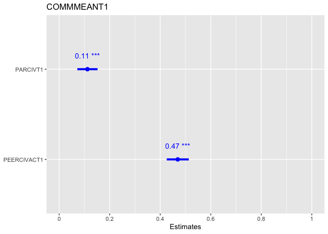

PY329 Project
================
Mursal Jahed
2024-10-11

\#load packages

``` r
library(haven)
library(dplyr)
```

    ## 
    ## Attaching package: 'dplyr'

    ## The following objects are masked from 'package:stats':
    ## 
    ##     filter, lag

    ## The following objects are masked from 'package:base':
    ## 
    ##     intersect, setdiff, setequal, union

``` r
library(ggplot2)
library(tidyr) 
library(psych)
```

    ## Warning: package 'psych' was built under R version 4.3.3

    ## 
    ## Attaching package: 'psych'

    ## The following objects are masked from 'package:ggplot2':
    ## 
    ##     %+%, alpha

``` r
library(car)
```

    ## Loading required package: carData

    ## 
    ## Attaching package: 'car'

    ## The following object is masked from 'package:psych':
    ## 
    ##     logit

    ## The following object is masked from 'package:dplyr':
    ## 
    ##     recode

``` r
library(lmtest)
```

    ## Loading required package: zoo

    ## 
    ## Attaching package: 'zoo'

    ## The following objects are masked from 'package:base':
    ## 
    ##     as.Date, as.Date.numeric

``` r
library(performance)
```

    ## Warning: package 'performance' was built under R version 4.3.3

``` r
library(sjPlot)
```

    ## Warning: package 'sjPlot' was built under R version 4.3.3

    ## Learn more about sjPlot with 'browseVignettes("sjPlot")'.

``` r
#load dataset
load("/Users/mursal_j/Downloads/ICPSR_36561/DS0001/36561-0001-Data.rda")
```

\#clean data

``` r
list_projectdata <- drop_na(da36561.0001)
```

\#select variables

``` r
list_projectdata <- da36561.0001 %>% 
  select(PEERCIVACT1, PARCIVT1, COMMMEANT1, GENDERT1, ETH_MCT1, GRADET1, GOVTRESPT1)
```

\#Checking for Assumptions

``` r
model <- lm(COMMMEANT1 ~ PARCIVT1 + PEERCIVACT1, data = list_projectdata)
check_model(model)
```

<!-- -->

``` r
summary(model)
```

    ## 
    ## Call:
    ## lm(formula = COMMMEANT1 ~ PARCIVT1 + PEERCIVACT1, data = list_projectdata)
    ## 
    ## Residuals:
    ##      Min       1Q   Median       3Q      Max 
    ## -2.09159 -0.47713  0.02234  0.48046  2.37331 
    ## 
    ## Coefficients:
    ##             Estimate Std. Error t value Pr(>|t|)    
    ## (Intercept)  0.59395    0.09198   6.457 1.46e-10 ***
    ## PARCIVT1     0.11182    0.02040   5.483 4.97e-08 ***
    ## PEERCIVACT1  0.46931    0.02221  21.126  < 2e-16 ***
    ## ---
    ## Signif. codes:  0 '***' 0.001 '**' 0.01 '*' 0.05 '.' 0.1 ' ' 1
    ## 
    ## Residual standard error: 0.664 on 1402 degrees of freedom
    ##   (173 observations deleted due to missingness)
    ## Multiple R-squared:  0.2779, Adjusted R-squared:  0.2768 
    ## F-statistic: 269.7 on 2 and 1402 DF,  p-value: < 2.2e-16

\#Analysis - How do parental vs peer civic involvement influence civic
involvement in teenagers?

``` r
plot_model(model,  type ="est",  show.values = TRUE, vline.color = "#1B191999", line.size = 1.5, dot.size = 2.5, colors = "blue")
```

<!-- -->

\#Analysis - How does this relationship change if the teens’ beliefs
about government responsiveness is taken into account?

``` r
model <- lm(COMMMEANT1 ~ PARCIVT1 * GOVTRESPT1 + PEERCIVACT1 * GOVTRESPT1, data = list_projectdata)
check_model(model)
```

<!-- -->

``` r
summary(model)
```

    ## 
    ## Call:
    ## lm(formula = COMMMEANT1 ~ PARCIVT1 * GOVTRESPT1 + PEERCIVACT1 * 
    ##     GOVTRESPT1, data = list_projectdata)
    ## 
    ## Residuals:
    ##      Min       1Q   Median       3Q      Max 
    ## -2.11227 -0.47372  0.02273  0.47196  2.41465 
    ## 
    ## Coefficients:
    ##                         Estimate Std. Error t value Pr(>|t|)    
    ## (Intercept)             0.888351   0.273076   3.253  0.00117 ** 
    ## PARCIVT1                0.115976   0.063888   1.815  0.06969 .  
    ## GOVTRESPT1             -0.109071   0.095162  -1.146  0.25192    
    ## PEERCIVACT1             0.378000   0.070964   5.327 1.17e-07 ***
    ## PARCIVT1:GOVTRESPT1    -0.001112   0.022095  -0.050  0.95987    
    ## GOVTRESPT1:PEERCIVACT1  0.033324   0.024402   1.366  0.17229    
    ## ---
    ## Signif. codes:  0 '***' 0.001 '**' 0.01 '*' 0.05 '.' 0.1 ' ' 1
    ## 
    ## Residual standard error: 0.6633 on 1392 degrees of freedom
    ##   (180 observations deleted due to missingness)
    ## Multiple R-squared:  0.2803, Adjusted R-squared:  0.2777 
    ## F-statistic: 108.4 on 5 and 1392 DF,  p-value: < 2.2e-16

``` r
plot_model(model, type = "est", show.values = TRUE, vline.color = "#1B191999", 
           line.size = 1.5, dot.size = 2.5, colors = "blue", 
           terms = c("PARCIVT1", "PEERCIVACT1"), 
           interaction = TRUE)
```

<!-- -->
